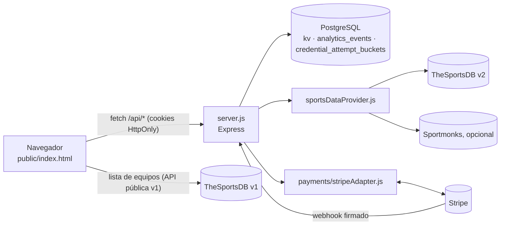

# Arquitectura de QRACKS

Contrastada con `main` en `4e5cbec` (2026-10-06). Reemplaza al antiguo `docs/ARCHITECTURE` (julio 2026), que describía una base normalizada y un cálculo de puntos en el servidor que ya no existen.

QRACKS es un monolito pequeño:
- un único proceso Node/Express (`server.js`) con módulos de dominio en la raíz;
- una página única en el navegador (`public/index.html`);
- PostgreSQL usado casi entero como almacén de documentos JSON (tabla `kv`).

No hay framework de frontend, ORM ni colas. Hay **una instancia** por entorno (ver [OPERATIONS.md](OPERATIONS.md)).

## 1. Navegador: `public/index.html`

Es un solo archivo con un solo `<script>`. La ruta se decide al cargar a partir de `window.location.pathname`:

| Ruta | Qué muestra |
|---|---|
| `/` | Landing (`renderHome`). |
| `/crear` | Crear una quiniela (`renderCrear`). |
| `/q/:slug` | La quiniela: login por nombre y PIN, confirmación de sesión («¿Eres Ana?»), y luego pestañas Jornada, Tabla, Historial y Admin (`render`, `renderApp`). |
| `/q/:slug?setup=1` | Recorrido de alta justo después de crear: PIN del admin, primera jornada e invitación (`renderAdminSetup*`). |
| `/q/:slug?ver` | Vista de espectador, de sólo lectura (`renderSpectatorView`). |
| `/a/:slug` | La misma quiniela, abierta directamente en Admin. Es la vuelta del pago con Stripe. No concede nada: entrar como admin sigue exigiendo una sesión de admin válida. Una vuelta antigua `/q/…?qz_pago` se reescribe a `/a/`. |
| `/panel-plataforma` | Panel del operador de QRACKS (`renderPlatformDashboard`): crecimiento, activación, pagos, datos deportivos, planes y acceso. |
| Otra ruta | `renderUnknownRoute`. Si la quiniela no existe, `renderQuinielaNotFound`. |

Vistas de Admin (`renderAdmin`):
- Jornadas (`renderAdminRondas`);
- Resultados (`renderAdminResultados`);
- Participación (`renderAdminParticipacion`);
- Participantes (`renderAdminParticipantes`);
- Adicionales (`renderAdminAdicionales`);
- Ajustes (`renderAdminOwner`).

**Cómo habla con el servidor**
- `fetch` con `credentials: "same-origin"`, así que las cookies HttpOnly viajan solas.
- `setAuthHeaders` añade las cabeceras de credencial ([flujos/acceso.md](flujos/acceso.md)).
- La contraseña de admin y la de plataforma se guardan **sólo en memoria** y se pierden al recargar.
- Envoltorios principales: `kvGet`, `getMeta`, `setMeta` y `getPicks`, más las rutas específicas de cada flujo.
- La hora del servidor se sincroniza con `GET /api/health`, para que las cuentas regresivas no dependan del reloj del teléfono.

**Puntuación, tabla e historial se calculan en el navegador** (`pointsFor` y `standingsList`), a partir de la meta y los pronósticos que el servidor deja ver. El servidor no calcula puntos. Ver [flujos/pronosticos.md](flujos/pronosticos.md).

**Llamada externa directa.** Para sugerir nombres de equipos, el navegador consulta la API pública v1 de TheSportsDB (`search_all_teams.php` con la clave pública `123`). Es la única llamada del navegador a un tercero.

**`localStorage`** guarda sólo comodidades del dispositivo:
- `qracks_device_id`, para la analítica;
- marcas de onboarding y de eventos ya contados;
- la intención de cierre de torneo en curso;
- la compra pendiente al volver del pago.

**Ninguna credencial se guarda en el navegador.**

## 2. Servidor: `server.js`

`server.js` concentra las rutas HTTP, la autorización y las transacciones. La lógica pura vive en módulos (§4).

Al arrancar:
1. exige `DATABASE_URL` y `PLATFORM_PASSWORD`; sin ellas, termina;
2. crea o migra tablas (`ensureTable`, §3);
3. carga los contadores de intentos;
4. comprueba la configuración de pagos y la registra (`payments_readiness`).

Si la base no responde, reintenta 5 veces cada 3 s y luego termina.

**Middleware, en este orden:**
1. `trust proxy 1`.
2. `express.raw` de 1 MB **sólo** en la ruta del webhook de Stripe. Va antes del parser JSON porque la firma se verifica sobre el cuerpo crudo.
3. `express.json` de 3 MB.
4. `Cache-Control: no-store` en todo `/api`.
5. Al final, los estáticos de `public/` y el fallback a `index.html`.

**Autorización.** El detalle está en [flujos/acceso.md](flujos/acceso.md). Hay tres niveles para escribir la meta de una quiniela (`resolveMetaAuthTier`):
- `owner`: la contraseña de administrador de esa quiniela, sin ligar a un participante;
- `platform`: la contraseña del panel de plataforma;
- `admin-pin`: el PIN o la sesión de un participante que es admin.

**Endpoints por área.** Cada flujo tiene su documento; aquí sólo el mapa:

| Área | Endpoints | Documento |
|---|---|---|
| Acceso | `POST /api/create-quiniela`, `/api/self-register`, `/api/verify-pin`, `/api/set-pin`, `/api/verify-owner`, `/api/recover-admin-pin`, `/api/verify-session`, `/api/clear-session`, `/api/migrate-quiniela` (legado) | [flujos/acceso.md](flujos/acceso.md) |
| Almacén genérico | `GET`, `POST` y `DELETE` `/api/kv/:key`, sólo para las claves que reconoce `classifyKey` | §3 |
| Jornadas y torneo | `POST /api/quinielas/:slug/sync-competition`, `GET /api/quinielas/:slug/sports-results`, `GET /api/quinielas/:slug/rounds/:roundId/sports-results`, `POST /api/quinielas/:slug/tournament/close`, `POST /api/quinielas/:slug/tournament/new-cycle` | [flujos/jornadas.md](flujos/jornadas.md) |
| Pronósticos | `POST /api/picks-batch`, `POST /api/submit-bet-answer` y los picks por `/api/kv` | [flujos/pronosticos.md](flujos/pronosticos.md) |
| Plan | `GET /api/quinielas/:slug/plan` | [flujos/planes.md](flujos/planes.md) |
| Pagos | `POST /api/payments/stripe/webhook`, `POST /api/quinielas/:slug/checkout`, `GET /api/quinielas/:slug/checkout/:purchaseId` | [flujos/pagos.md](flujos/pagos.md) |
| Plataforma | `POST /api/verify-platform`, `POST /api/platform/quinielas/:slug/entitlement`, `POST /api/platform/quinielas/:slug/settings`, `POST /api/delete-quiniela`, `GET /api/platform/payments-readiness`, `GET /api/platform/client-ip-check`, `GET /api/platform-sports-health`, `GET /api/platform-analytics` | §2.1 |
| Analítica | `POST /api/track-event` (pública, con lista blanca de eventos) | §2.2 |
| Salud y páginas | `GET /api/health`, `GET /a/:slug`, `GET /q/:slug`, estáticos y `*` | [OPERATIONS.md](OPERATIONS.md) |

`GET /q/:slug` inyecta el título y la vista previa de enlaces (Open Graph) con el nombre de la quiniela; la URL de la vista previa es fija, `https://qracks.net/q/<slug>`. `GET /a/:slug` se sirve con `no-store` y `X-Robots-Tag: noindex`.

### 2.1 Panel de plataforma

Todo exige la contraseña de plataforma en `X-Qracks-Platform-Auth`.
- **Contraseña:** la inicial sale de `PLATFORM_PASSWORD`. En cuanto se cambia desde el panel, manda la guardada en `platform_settings`, con hash.
- **Qué permite:**
  - conceder o retirar Plus, una concesión manual (`MANUAL_GRANT`) o Free (`/entitlement`);
  - cambiar el nombre o la contraseña de admin de una quiniela (`/settings`);
  - borrar una quiniela;
  - consultar los diagnósticos de pagos, de IP y de datos deportivos, y la analítica.

### 2.2 Analítica

- `POST /api/track-event` es pública y sólo acepta una lista cerrada de eventos:
  - `landing_viewed`, `create_started`, `quiniela_created`;
  - `access_link_opened`, `join_started`, `join_completed`;
  - `session_restored`, `session_confirmation_accepted`, `session_confirmation_rejected`;
  - `first_pick_saved`, `picks_completed`;
  - `invite_shared`, `standings_shared`, `standings_viewed`;
  - `first_round_published`, `result_published`;
  - `upgrade_cta_clicked`.
- Se guardan en la tabla `analytics_events` con estas columnas: nombre del evento, slug, id interno del participante si lo hay, si es usuario nuevo, identificador de dispositivo (`qracks_device_id`) y fuente. No incluyen nombres, PINs ni pronósticos.
- El panel sólo ve agregados (`/api/platform-analytics`).

## 3. PostgreSQL

No hay ORM ni carpeta de migraciones. `ensureTable()` crea y migra todo al arrancar, de forma idempotente.

| Tabla | Para qué |
|---|---|
| `kv (key TEXT PRIMARY KEY, value JSONB, updated_at)` | Todo el modelo de datos, como documentos JSON. |
| `analytics_events` | Eventos de §2.2. |
| `credential_attempt_buckets` | Contadores del límite de intentos, para sobrevivir a reinicios. Ver [SECURITY_CREDENTIAL_LIMITS.md](SECURITY_CREDENTIAL_LIMITS.md). |

**Claves de `kv`** (`classifyKey` rechaza cualquier otra):

| Clave | Contenido |
|---|---|
| `quiniela:<slug>:meta` | El documento de una quiniela: `groupName`, `participants[]`, `rounds[]`, `roundsRevision`, `settings`, `customBets`, `pastTournaments`, `stagedFixtures`, `tournamentEpoch`, `participantsRevision`. Los PINs y la contraseña de admin se guardan con hash scrypt y nunca salen del servidor. |
| `quiniela:<slug>:picks:<participantId>` | Los pronósticos de un participante, por jornada. |
| `quiniela_meta_v1`, `quiniela_picks_<id>_v1` | La quiniela única anterior a `/q/:slug` (legado). Tras migrar queda `{migratedTo}`. |
| `platform_index` | Una entrada por quiniela: nombre, creador, contacto, plan (`entitlement`), historial y ciclo del torneo. |
| `platform_settings` | Contraseña del panel, con hash. |
| `platform_payment_log` | Libro de pagos y concesiones. |
| `platform_payment_intents` | Compras, eventos de Stripe ya vistos y auditoría. **Sólo la escribe el servidor.** |
| `commercial_config` | Precios y límites vigentes; los edita la plataforma. |
| `sports_data_health` | Estado del proveedor de datos deportivos. |
| `__session_secret__` | Secreto HMAC de las cookies. No se puede leer por la API. |

**Lectura filtrada por rol.**
- `GET /api/kv` de una meta quita los secretos (`stripQuinielaSecrets`).
- La de pronósticos aplica las reglas de visibilidad (`filterPicksForRequest`).
- Las filas de dinero (`platform_payment_log`, `platform_payment_intents`) sólo las ve la plataforma.

**Escrituras de varias filas.** Toman los candados siempre en este orden, para no bloquearse entre sí:

`platform_index → meta de la quiniela → platform_payment_intents → platform_payment_log`

**Migraciones al arrancar**, en orden:
1. `credential_attempt_buckets`, con RLS activado;
2. `kv`;
3. semillas de `platform_index`, `sports_data_health` y del secreto de sesión;
4. `roundsRevision` inicial;
5. `analytics_events` e índices;
6. semilla de `commercial_config`;
7. el plan y el primer ciclo de torneo de las quinielas que aún no los tenían.

**Seguridad de la base.** `docs/security/sec-002-hardening.sql` niega el acceso directo a `kv` y `analytics_events` a los roles de la API de Supabase. Se aplica a mano. Su estado está en [OPERATIONS.md](OPERATIONS.md).

## 4. Módulos

| Módulo | Responsabilidad |
|---|---|
| `adminPinClaim.js` | Quién puede elegir el primer PIN de un admin: la cookie de creación, de 7 días. |
| `clientIp.js` | La IP real del cliente detrás de Cloudflare y Render, para los límites. |
| `credentialAttempts.js` | Límite de intentos fallidos y espera progresiva. |
| `metaParticipants.js` | Fusión de participantes y revisiones, contra escrituras de pestañas viejas. |
| `roundsConcurrency.js` | Quién puede reemplazar `meta.rounds` (`roundsRevision`, 409 si la pestaña está atrasada). |
| `competitionSync.js` | Plan puro de la importación de jornadas desde el proveedor. |
| `autoResults.js`, `scoreContract.js` | Cuándo buscar resultados automáticos; el 1X2 sale sólo del marcador reglamentario. |
| `sportsDataProvider.js` | Fachada única de datos deportivos (TheSportsDB y Sportmonks) con caché de 8 min. |
| `sportsDomain.js`, `providers/*` | Vocabulario deportivo independiente del proveedor y adaptadores. `providerRegistry.js` y `theSportsDbDomainAdapter.js` sólo los usan los tests. |
| `sportsDataHealth.js` | Estado del proveedor que ve el panel. |
| `seasonDefaults.js` | Temporada por defecto según la fecha (UTC). |
| `planLimits.js`, `tournamentScope.js`, `competitionCoverage.js`, `platformState.js` | Planes, límites, ciclos del torneo, qué cubre Plus y concesiones. |
| `payments/paymentsDomain.js`, `payments/stripeAdapter.js` | Dominio puro de pagos y la frontera con Stripe (firma, sesiones, readiness). |
| `scripts/security/pre-commit-secret-check.sh` | Bloquea secretos en commits; también corre en CI. |

## 5. Integraciones

| Servicio | Quién lo llama | Configuración | Si falta |
|---|---|---|---|
| TheSportsDB v2 | El servidor: importación de jornadas y resultados | `THESPORTSDB_API_KEY` | La importación y los resultados automáticos fallan (`provider_auth_error`). Lo manual sigue funcionando. |
| TheSportsDB v1 (pública) | El navegador: nombres de equipos | Clave pública `123` en el código | No aparecen sugerencias. |
| Sportmonks | El servidor, sólo en quinielas con `settings.provider = "sportmonks"` | `SPORTMONKS_API_TOKEN` | Esas quinielas no sincronizan. |
| Stripe | El servidor: checkout, consulta y webhook | `STRIPE_SECRET_KEY`, `STRIPE_WEBHOOK_SECRET`, `PUBLIC_BASE_URL`: las tres o ninguna | Ninguna: pagos desactivados. Algunas: `MISCONFIGURED`, que falla cerrado. Ver [flujos/pagos.md](flujos/pagos.md). |
| Cloudflare | Delante de producción (`qracks.net`) | — | — |

## 6. Límites conocidos de esta arquitectura

- **Una instancia por entorno.** Los cachés y el límite de intentos viven en memoria; el límite se respalda en la base. Con varias instancias, el presupuesto de intentos se multiplicaría ([SECURITY_CREDENTIAL_LIMITS.md](SECURITY_CREDENTIAL_LIMITS.md) §4).
- **Plan `free` de Render.** El servicio se duerme tras unos minutos sin tráfico y la siguiente visita lo despierta, con un arranque en frío.
- **La meta de una quiniela es un solo documento.** Las escrituras concurrentes se ordenan con candados de fila y revisiones (`roundsRevision`, `participantsRevision`), no con columnas.
